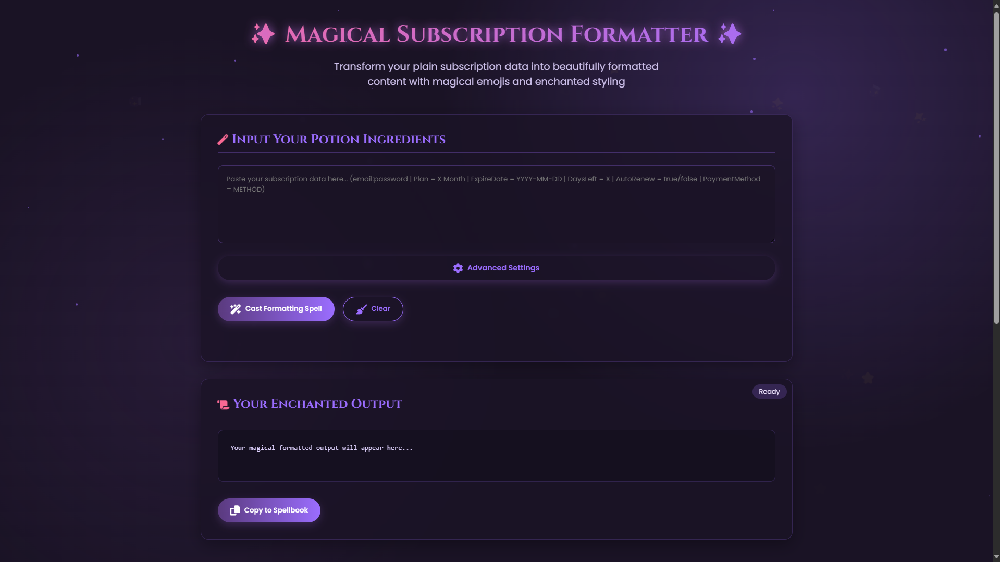

# ✨ Fantasy Subscription Formatter ✨

A magical tool that transforms plain subscription data into beautifully formatted content with emojis and enchanted styling. This formatter is designed to handle various input formats and present subscription information in a clean, visually appealing way.

## 🔮 Quick Links

- [Launch the Formatter](./Magical-Subscription-Formatter.html) - Open the application directly from this repository
- [View the Source Code](./Magical-Subscription-Formatter.html) - See the complete HTML, CSS, and JavaScript

   

## 🔮 Features

- **Magical UI:** Immersive fantasy-themed interface with animations and particle effects
- **Advanced Parsing:** Multiple strategies to handle any input format
- **Smart Field Detection:** Automatically identifies email, password, plan details, and more
- **Beautiful Formatting:** Adds appropriate emojis and styling to each field
- **Error Recovery:** Robust handling of malformed or inconsistent inputs
- **Copy to Clipboard:** One-click copying of formatted output
- **Responsive Design:** Works on desktop and mobile devices

## 🧙‍♂️ How It Works

1. Paste your subscription data in the input area
2. Click "Cast Formatting Spell"
3. Watch as your plain data transforms into beautifully formatted content
4. Copy the result with a single click

## 📋 Input Format

The formatter accepts subscription data in various formats

Multiple accounts can be separated by new lines or provided in a single line.

## 🎨 Formatting Rules

- **Email:** Displayed with 📧 emoji
- **Password:** Displayed in monospace format with backticks (`)
- **Plan:** Displayed with 🗓 emoji
- **Expiration Date:** Displayed with ⏳ emoji
- **Days Left:** Displayed with ⏳ emoji
- **Auto Renew:** Displayed with ✅ (true) or ❌ (false)
- **Payment Method:** Displayed with appropriate emoji (💳, 💵, 🍎, etc.)

## 📚 Advanced Options

The formatter includes several advanced options:

- **Aggressive Parsing:** Tries harder to extract information from difficult inputs
- **Multi-Strategy:** Uses multiple parsing methods to find the best result
- **Deep Inspection:** Looks for fields in non-standard formats
- **Error Recovery:** Attempts to recover data even when parsing fails

## 🚀 Usage

Simply open the [Magical-Subscription-Formatter.html](./Magical-Subscription-Formatter.html) file in any modern web browser. No server or installation required!

## 💻 Technical Details

This project is built with:
- HTML5
- CSS3 (with animations and effects)
- Vanilla JavaScript (no external libraries)

The parsing engine uses multiple strategies including:
- Pattern-based extraction
- Line-by-line analysis
- Delimiter-based sections
- Email-password pattern matching
- Aggressive extraction for difficult inputs

## 📜 License

MIT License - Feel free to use, modify, and distribute this code!

## 🧙‍♂️ Created By

Developed by [Darkphoenixir](https://github.com/Darkphoenixir) - The Fallen Angel

---

*This project was crafted with ✨ magic ✨*
